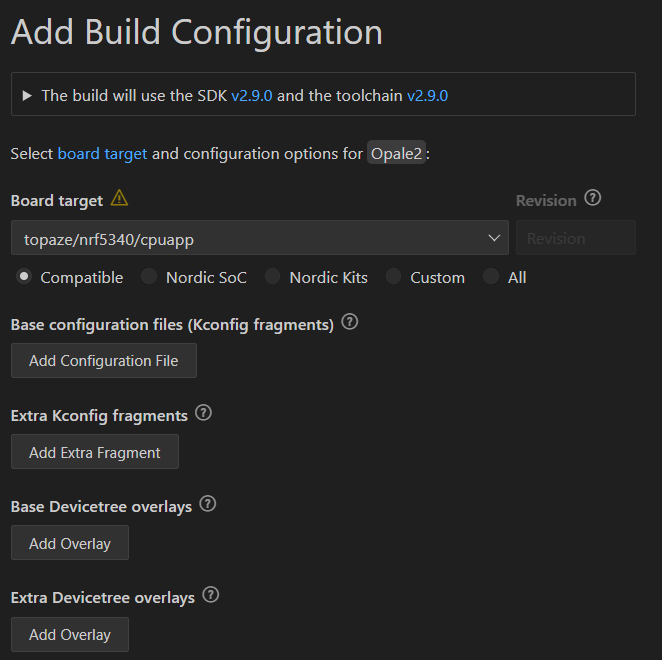
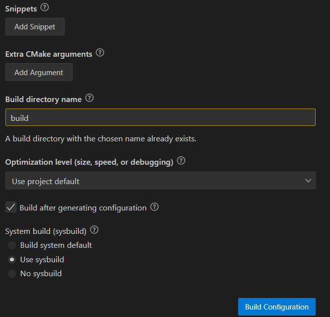

===========================
**Build**
===========================

This documentation is aimed to describe the build process used in this project..

---------------------------
How an image is built ?
---------------------------

First, let's explore how an image is composed and built.

An image is composed from multiples things :

#. MCUBoot, that handle the very first steps when powered up
#. A kernel, here Zephyr RTOS
#. A user application image

They're all compiled and flashed on the flash of the MCU.

All of theses complicated steps are handled by sysbuild link https://academy.nordicsemi.com/courses/nrf-connect-sdk-intermediate/lessons/lesson-8-sysbuild/

Sysbuild is configured trough a lot of different files :

* prj.conf
* CMakeLists.txt
* boards/topaze/
* nRF Connect GUI

^^^^^^^^^^^^^^^^^^^^^^^^^^
prf.conf
^^^^^^^^^^^^^^^^^^^^^^^^^^
This file is left empty, because of the custom boards file link topaze/topaze_nrf5340_cpuapp_defconfig.
This file would be full if we're using a standard developpement board, for example nRF5340DK.

^^^^^^^^^^^^^^^^^^^^^^^^^^
CMakeLists.txt
^^^^^^^^^^^^^^^^^^^^^^^^^^
This file handle all of the stuff around the C / C++ compilation into executable.
Syntax is standard for a CMake file, at the exeception of the target_sources command to add a file.
Repeat is as many times as needed.

^^^^^^^^^^^^^^^^^^^^^^^^^^^
boards/topaze
^^^^^^^^^^^^^^^^^^^^^^^^^^^
This folder will be described more in details in the devicetree.rst file !

^^^^^^^^^^^^^^^^^^^^^^^^^^^
nRF COnnect GUI
^^^^^^^^^^^^^^^^^^^^^^^^^^^
This GUI configure some high level parameters about the build system.
Here some screenshots about this config :

