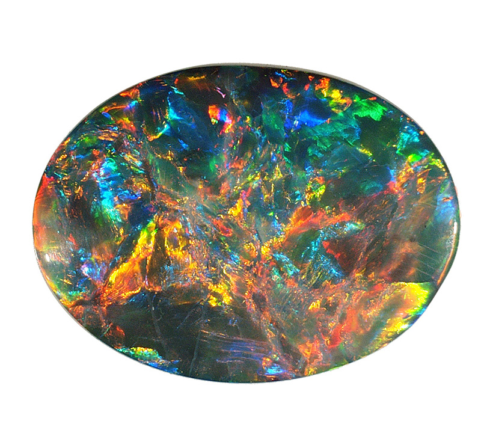

############
**Opale**
############

This is a school project, to design and program a flight controller for a small scale rocket.

You may found a lot of documentation under the documentation/* folder.

===================
Dependencies
===================
This project exploit the Bosch BNO055 driver for this 9 axis IMU : 

:ref: https://github.com/boschsensortec/BNO055_SensorAPI

===================
Folder structure
===================

| 📦Opale2
|  ┣ 📂boards --> Define board configuration and the associated devicetree !
|  ┃ ┗ 📂topaze
|  ┃ ┃ ┣ 📜board.cmake
|  ┃ ┃ ┣ 📜board.yml
|  ┃ ┃ ┣ 📜Kconfig.defconfig
|  ┃ ┃ ┣ 📜Kconfig.topaze
|  ┃ ┃ ┣ 📜pre_dt_board.cmake
|  ┃ ┃ ┣ 📜topaze-cpuapp_partitioning.dtsi
|  ┃ ┃ ┣ 📜topaze-pinctrl.dtsi                    --> Most important file, define every function on the board !
|  ┃ ┃ ┣ 📜topaze-shared_sram.dtsi
|  ┃ ┃ ┣ 📜topaze_nrf5340_cpuapp.dts
|  ┃ ┃ ┣ 📜topaze_nrf5340_cpuapp.yml
|  ┃ ┃ ┣ 📜topaze_nrf5340_cpuapp_defconfig
|  ┃ ┃ ┣ 📜topaze_nrf5340_cpuapp_ns.dts
|  ┃ ┃ ┣ 📜topaze_nrf5340_cpuapp_ns.yml
|  ┃ ┃ ┣ 📜topaze_nrf5340_cpuapp_ns_defconfig
|  ┃ ┃ ┣ 📜topaze_nrf5340_cpunet.dts
|  ┃ ┃ ┣ 📜topaze_nrf5340_cpunet.yml
|  ┃ ┃ ┗ 📜topaze_nrf5340_cpunet_defconfig
|  ┣ 📂build --> Build folder
|  ┣ 📂documentation --> Doc folder
|  ┃ ┣ 📜build.rst
|  ┃ ┗ 📜devicetree.rst
|  ┣ 📂src --> Main source code
|  ┃ ┗ 📜main.c
|  ┣ 📜.gitignore
|  ┣ 📜CMakeLists.txt
|  ┣ 📜prj.conf
|  ┗ 📜readme.md (You're here !)

